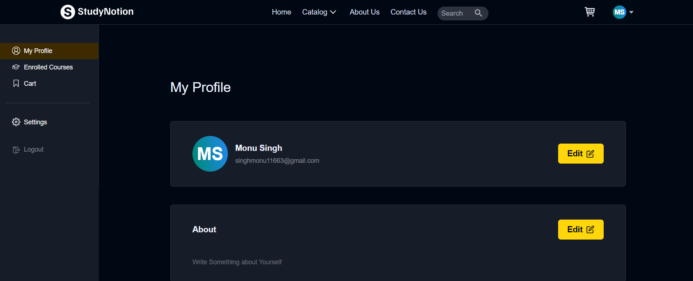
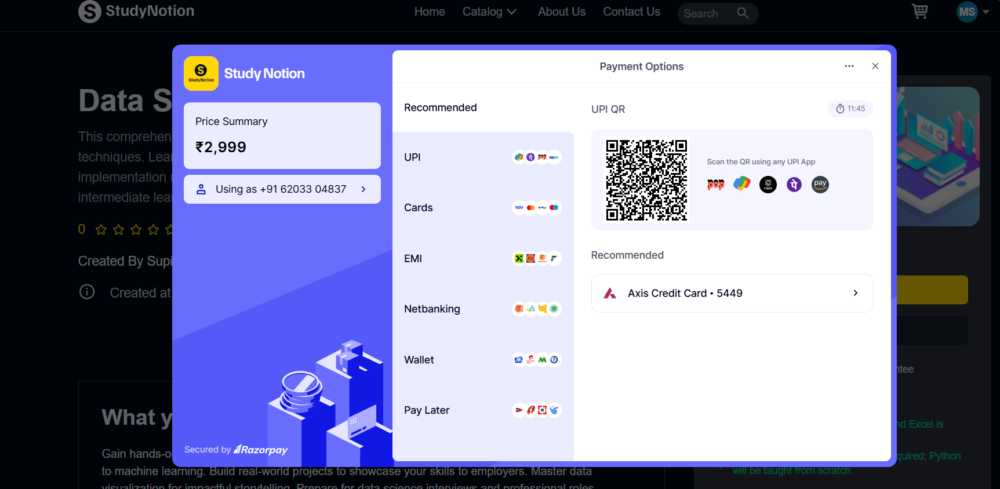

# Study Notion 📚
  

A full-stack MERN EdTech platform for online learning with courses, authentication, and payment integration.

## 🌐 Live Demo
[Study Notion Live](https://studynotion-platform-h4f2.onrender.com)

## 🖼 Screenshots





## ⚡ Features
- User authentication: Sign up / Login / Logout
- Course catalog with search and filter
- Course details with videos and content
- Payment integration using Razorpay
- Email notifications and OTP verification
- Admin features for course management (optional)
- Cloud storage for videos/images using Cloudinary

## 🛠 Tech Stack
**Frontend:** React, Redux, Tailwind CSS  
**Backend:** Node.js, Express  
**Database:** MongoDB Atlas  
**Authentication:** JWT  
**Cloud Services:** Cloudinary  
**Payment Gateway:** Razorpay

## 🚀 Installation / Setup (Local)
1. Clone the repository:
```bash
git clone https://github.com/vishnuKumarRoy/STUDY_NOTION.git
cd STUDY_NOTION

## Install backend dependencies
cd server
npm install

## Install frontend dependencies
cd client
npm install

## install root directory dependency
npm install

## run both frontend and backend simultaneouly
npm run dev

